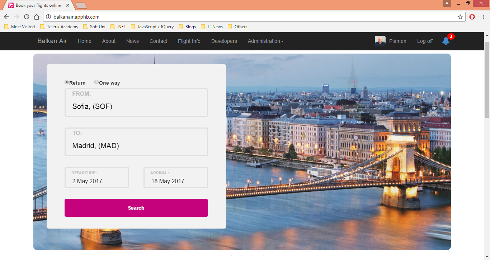
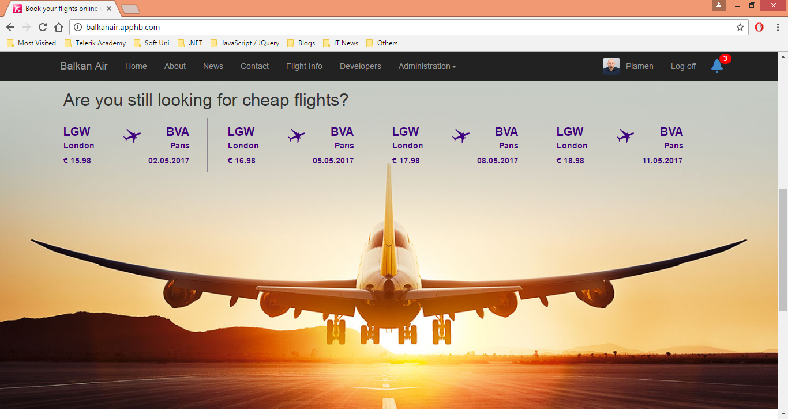
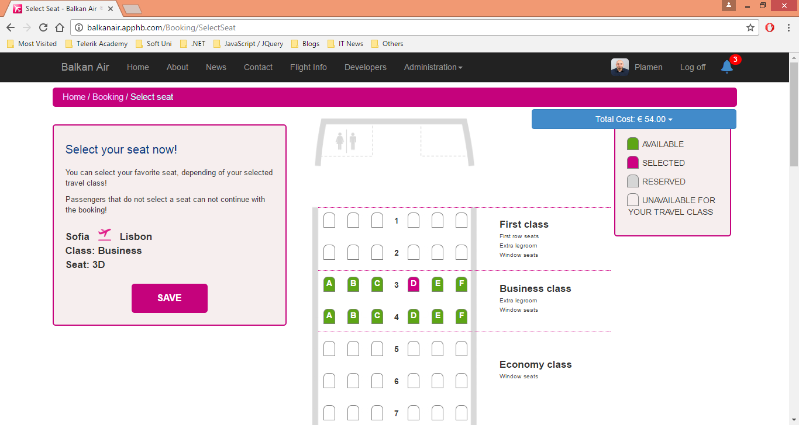
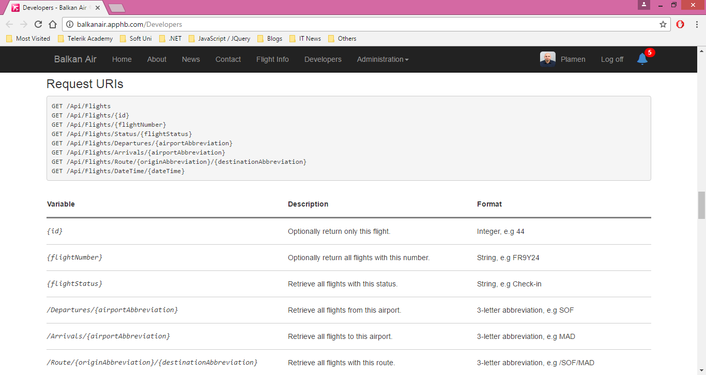

# Balkan-Air
Airline Reservation System

## Technologies

* ASP.NET Web Forms
* ASP.NET Web API
* Entity Framework Code First
* Repository pattern
* MVP pattern

## Libraries

* Ninject Dependency Injector
* Automapper, a object-object mapper
* Moq, mocking framework
* WebFormsMvp
* MyTested.WebApi
* ASP.NET AJAX Control Toolkit
* Bootstrap
* jQuery and jQuery UI

## Screenshots

